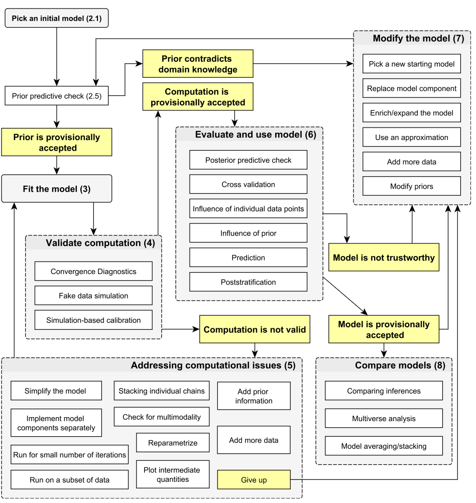

.. project_name documentation master file, created by
   sphinx-quickstart on Tue Mar  8 16:55:41 2022.
   You can adapt this file completely to your liking, but it should at least
   contain the root `toctree` directive.

Welcome to {{ cookiecutter.project_name }}'s documentation!
===========================================================

.. toctree::
   :maxdepth: 2
   :caption: Contents:

Write your documentation here in `reStructuredText <https://www.sphinx-doc.org/en/master/usage/restructuredtext/index.html>`_.

.. _how_to_build:

How to do build the documentation
=================================

To create an html version of this documentation, run the command

.. code:: sh

   make docs

from the project root directory.

.. _how_to_do_some_things_with_rst:

How to do some things with reStructuredText
===========================================

Include images like this:

.. _reference:

Reference
=========

The main reason to use Sphinx is for automatic documentation of Python code.

Data preparation module
-----------------------

.. automodule:: {{ cookiecutter.repo_name }}.data_preparation
   :members:

Indices and tables
==================

* :ref:`genindex`
* :ref:`modindex`
* :ref:`search`
