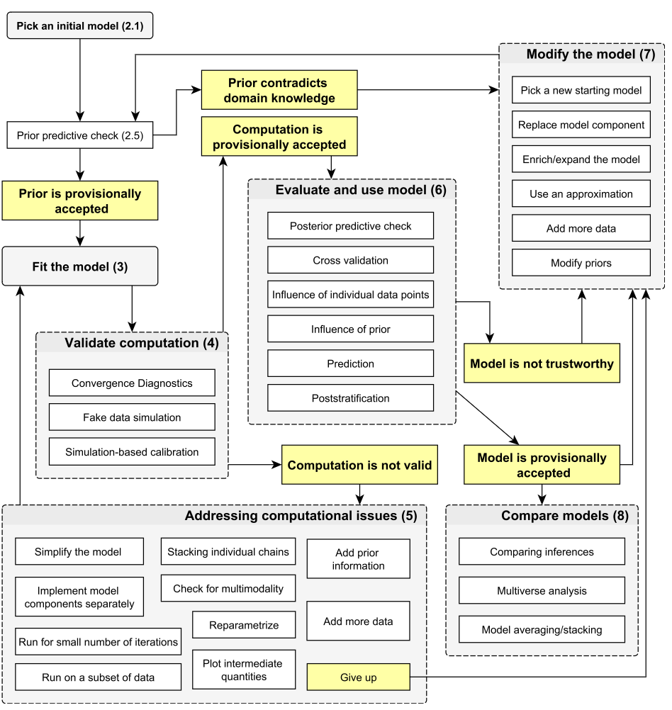

.. project_name documentation master file, created by
   sphinx-quickstart on Tue Mar  8 16:55:41 2022.
   You can adapt this file completely to your liking, but it should at least
   contain the root `toctree` directive.

Welcome to project_name's documentation!
========================================

.. toctree::
   :maxdepth: 2
   :caption: Contents:

Write your documentation here in `reStructuredText <https://www.sphinx-doc.org/en/master/usage/restructuredtext/index.html>`_.

Include images like this:

Indices and tables
==================

* :ref:`genindex`
* :ref:`modindex`
* :ref:`search`
